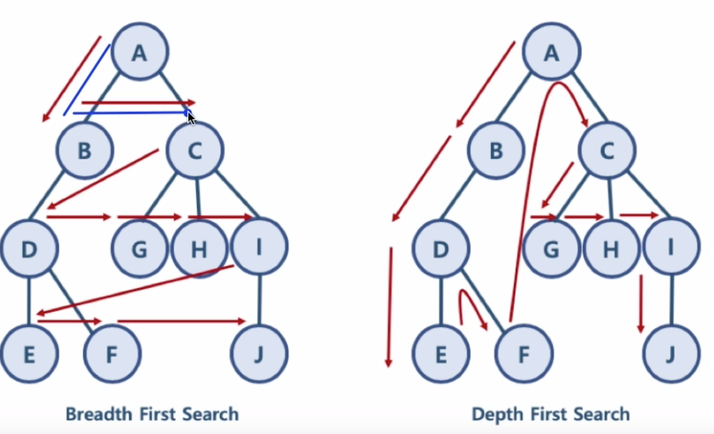
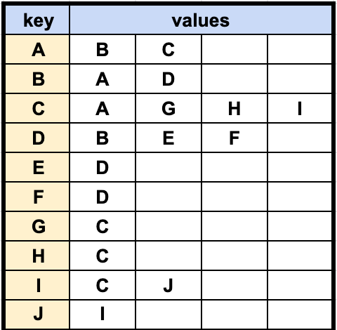

## DFS 알고리즘 구현 (python)
DFS, BFS 둘 다 연결에 우선순위가 있는 것이 아니므로
왼쪽을 먼저 탐색하든 오른쪽을 먼저 탐색하든 상관 없음






stack, queue를 활용함
-> need_visit 스택과 visited 큐, 두 개의 자료구조를 생성.
> BFS : Queue 2개 
> 
> DFS : Stack 1개 + Queue 1개

```
# 간단하게 python list를 통해 스택과 큐의 정책을 구현 가능
# 따라서 스택, 큐를 따로 선언 안하고 list로 할 수 있다.

def bfs(graph, start_node):
	visited, need_visit = list(), list()
	
	need_visit.append(start_node)
	
	while need_visit:
		node = need_visit.pop()
		if node not in visited:
			visited.append(node)
			need_visit.extend(graph[node])
	
	return visited

dfs(graph,'A')
```
## 시간 복잡도
일반적인 DFS 시간 복잡도
  노드 수 : V
  간선 수 : E
    위 코드에서 while need_visit 은 V + E 번 만큼 수행함
  시간 복잡도 : O(V+E)
  
